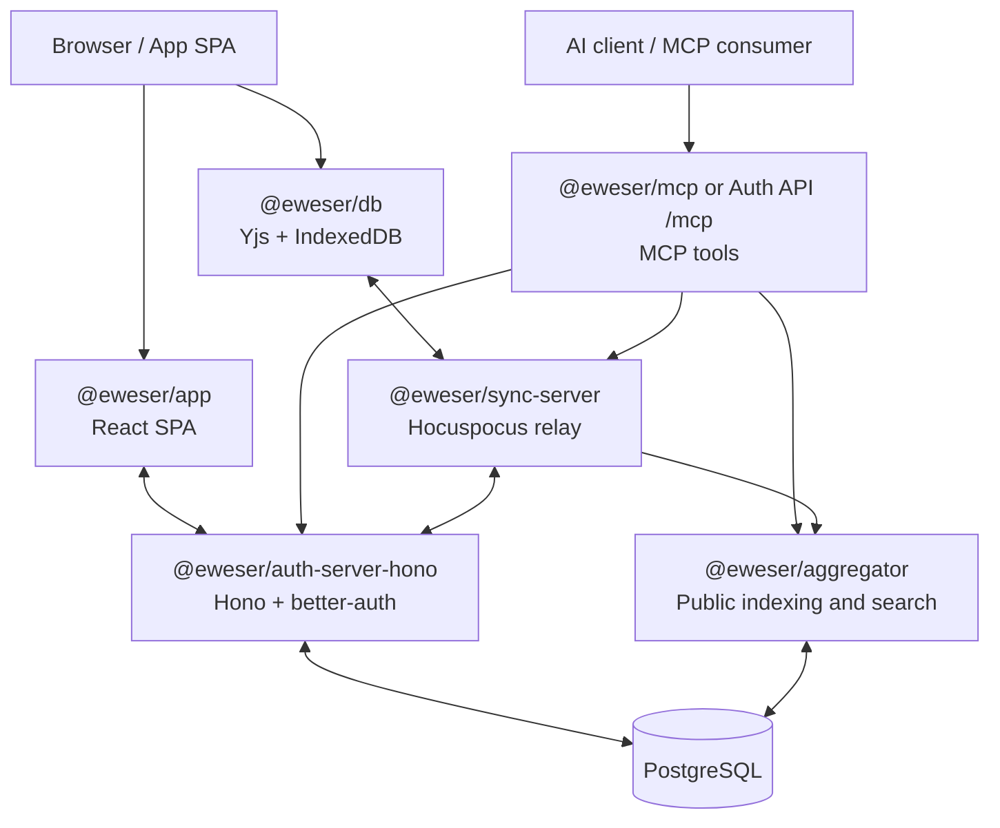

# Architecture - EweserDB

> **Status:** Active. The Next.js/Supabase migration is complete; the current auth stack is Hono + better-auth.

## Overview

EweserDB is a local-first, user-owned database SDK built on Yjs CRDTs. Users
own their data, and apps interoperate over shared schemas. Room access grants,
remote sync, public aggregation, user snapshots, encrypted-room planning, and
MCP access are all scoped around rooms and shared schemas.

## Runtime Topology



## Monorepo Structure

```
packages/
  db/                  -> @eweser/db
  shared/              -> @eweser/shared
  auth-server-hono/    -> @eweser/auth-server-hono
  app/                -> @eweser/app
  sync-server/         -> @eweser/sync-server
  aggregator/          -> @eweser/aggregator
  ewe-note/            -> @eweser/ewe-note
  examples-components/ -> @eweser/examples-components
  mcp-server/          -> @eweser/mcp
  eslint-config-*/     -> shared lint configs

examples/
  example-basic/
  example-multi-room/
  example-interop-notes/
  example-interop-flashcards/
  example-aggregator/
  react-native/

e2e/
  cypress/
```

## Current Stack

| Layer         | Current                                              |
| ------------- | ---------------------------------------------------- |
| Core SDK      | TypeScript, Yjs, y-indexeddb, `@hocuspocus/provider` |
| Auth API      | Hono, better-auth, Drizzle ORM                       |
| Auth UI       | React SPA built with Vite                            |
| Sync server   | Hocuspocus with SQLite-backed persistence            |
| Aggregation   | Server-side indexing over webhook-fed documents      |
| MCP access    | `@eweser/mcp` plus auth-server remote HTTP `/mcp`    |
| Backups       | User snapshots plus auth metadata and object storage |
| Frontend apps | React 18-19, Vite, Tailwind CSS, Radix UI            |
| Editor        | TipTap in `packages/ewe-note`                        |
| Testing       | Vitest and Cypress                                   |
| Build         | Vite, `tsc`, npm workspaces                          |

## Deployment Shape

- `docker-compose.dev.yml` runs the backend stack locally: PostgreSQL, two sync servers, the aggregator, auth API, and Dozzle.
- Frontend apps run on the host for hot reloading.
- `docker-compose.prod.yml` is the full stack: backend services plus Caddy and the frontend SPA containers.

## Development Workflow

1. Start backend services:

   ```bash
   npm run dev:docker
   ```

2. Start the frontend workspaces you need:

   ```bash
   npm run dev
   npm run dev --workspace @eweser/app
   npm run dev --workspace @eweser/ewe-note
   ```

3. Use workspace-specific scripts when you need a narrower watch loop:
   - `npm run dev --workspace @eweser/db`
   - `npm run dev --workspace @eweser/shared`
   - `npm run dev --workspace @eweser/example-basic`

## Data Flow

1. A browser app loads local state from IndexedDB through `@eweser/db`.
2. The app redirects to or embeds the app SPA for sign-in, signup, and access grants.
3. The auth API issues session state, room access grants, and sync tokens.
4. The sync server authenticates the token and relays Yjs updates.
5. The aggregator receives Hocuspocus webhooks and indexes explicitly public
   room data for public search.
6. MCP clients use an agent token or OAuth token to access only rooms in their
   readable or writable room scope.
7. User snapshot flows export selected rooms into portable backup bundles;
   auth-server PostgreSQL stores only operational snapshot metadata.

## Key Concepts

### Rooms

A room is a Yjs-backed container with a collection key, shared schema, and room
access control. Rooms are the main authorization and remote-sync boundary.
Folders and bases may organize room content, but they do not replace room
collection boundaries.

### Bases And Vaults

A base is the user-facing workspace unit for vault-style data. For Obsidian
compatibility, one base maps to one vault.

Internally, bases group rooms rather than replacing room collection boundaries.
The current desktop vault sync path starts with a `notes` room and note-level
`sourcePath`/`sourceVault` metadata. Attachment metadata can be added as a
separate room when file sync graduates beyond local filesystem handling. Local
mount paths are device-local settings, not canonical synced data.

### Collections and Schemas

Collections define strongly typed document shapes. Apps that share a schema can interoperate on the same data.

### Remote Sync

Remote sync is optional Hocuspocus/Yjs synchronization through the sync relay.
The sync relay authenticates short-lived sync tokens for scoped room
connections and may forward publication metadata to the aggregator. Remote sync
does not make a room public.

### References

Documents can be linked by reference using `_ref` values in the form:

`${authServer}|${collectionKey}|${roomId}|${documentId}`

Use `buildRef()` from `@eweser/shared` to construct refs.

### Access Control

The auth API handles sessions, room ACLs, access grants, agent tokens, and sync
token issuance. Room ACLs define owner/admin/read/write rights. Access grants
authorize an app or agent for selected rooms and capabilities. Sync tokens
authorize specific remote-sync connections.

### Product Configuration

User-owned product configuration that should be visible across apps, agents, or
self-hosted deployments belongs in EweserDB rooms and shared schemas. PostgreSQL
in the auth server is for auth operations: users, sessions, grants, OAuth,
agent tokens, security events, and audit metadata needed to enforce access. Do
not make PostgreSQL the canonical store for interoperable user memory, strategy,
or workspace configuration unless the plan explicitly documents why an auth-only
operational mirror is needed.

EweserDB is still pre-live. Current-state docs and plans may choose clean schema
changes over prototype-data compatibility when that improves the long-term
model. PostgreSQL migrations are still append-only, and published package API
changes still need changesets.

### Public Aggregation

The aggregator indexes explicitly public rooms for public search. Public search
is separate from private remote sync, collaborator sharing, and MCP-readable
agent access.

### User Snapshots And Backups

User snapshots are portable backup bundles for selected rooms. They are not
sync replicas, operator PostgreSQL backups, sync relay persistence stores, or
federation backup listeners. Auth-server PostgreSQL may store operational
snapshot metadata, but user-owned room data remains in rooms, shared schemas,
and snapshot bundles.

### Encrypted Rooms

Ordinary hosted remote sync is not end-to-end encrypted. Encrypted rooms are an
opt-in room-level capability being planned for sensitive data. Current and
future docs must state the tradeoffs clearly, especially reduced or unavailable
public search, server-side MCP reading, recovery, and collaboration behavior.

### MCP And Agent Access

The MCP surface exposes authorized rooms to AI clients through local stdio or
the auth server's remote HTTP `/mcp` endpoint. MCP-readable rooms come from an
agent's readable room scope and are not public-searchable unless the room is
also explicitly public.

## Key Files

- `package.json` - root workspace scripts
- `docker-compose.dev.yml` - backend-only local compose
- `docker-compose.prod.yml` - production compose with Caddy and SPAs
- `packages/db/src/` - core SDK implementation
- `packages/shared/src/` - shared types and helpers
- `packages/auth-server-hono/src/` - auth API
- `packages/app/src/` - app SPA
- `packages/sync-server/src/` - sync relay
- `packages/aggregator/src/` - public indexing/search
- `packages/mcp-server/src/` - MCP tools for authorized agent room access
- `LOCAL_DEVELOPMENT.md` - local setup guide

## Historical Notes

Migration plans and ADRs live under `docs/ai/`. Treat them as historical context unless a file explicitly says it is current guidance.
