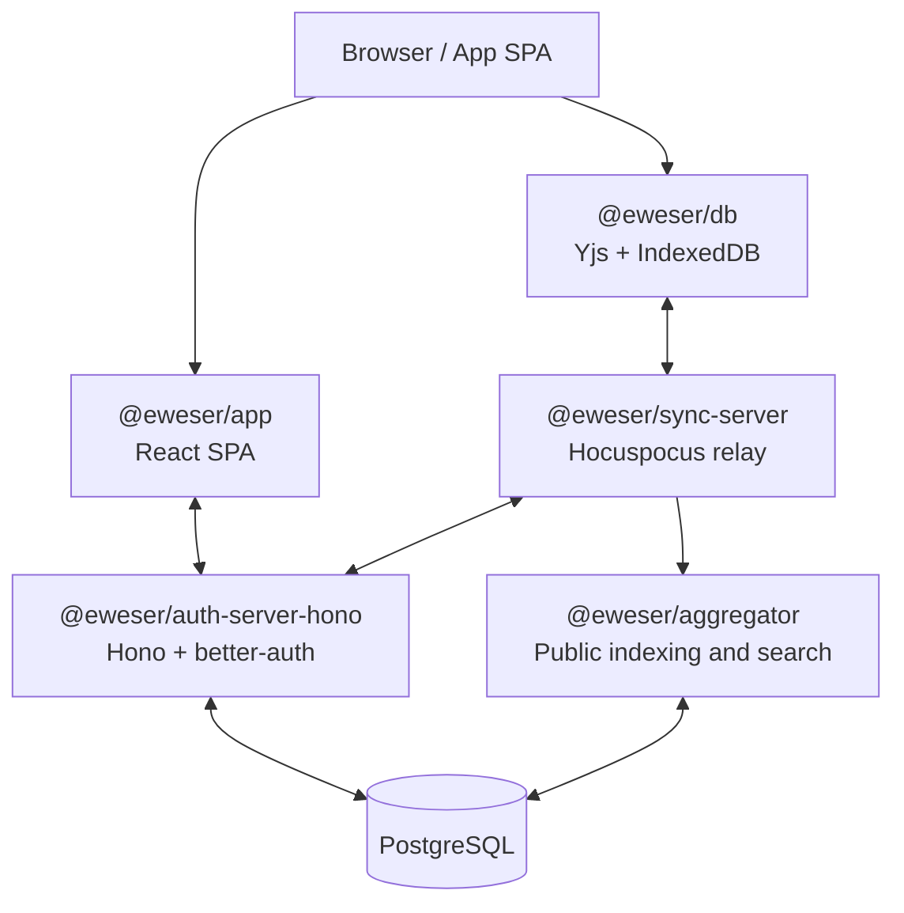

# Architecture - EweserDB

> **Status:** Active. The Next.js/Supabase migration is complete; the current auth stack is Hono + better-auth.

## Overview

EweserDB is a local-first, user-owned database SDK built on Yjs CRDTs. Users own their data, and apps interoperate over shared schemas.

## Runtime Topology



## Monorepo Structure

```
packages/
  db/                  -> @eweser/db
  shared/              -> @eweser/shared
  auth-server-hono/    -> @eweser/auth-server-hono
  app/                -> @eweser/app
  sync-server/         -> @eweser/sync-server
  aggregator/          -> @eweser/aggregator
  ewe-note/            -> @eweser/ewe-note
  examples-components/ -> @eweser/examples-components
  mcp-server/          -> @eweser/mcp
  eslint-config-*/     -> shared lint configs

examples/
  example-basic/
  example-multi-room/
  example-interop-notes/
  example-interop-flashcards/
  example-aggregator/
  react-native/

e2e/
  cypress/
```

## Current Stack

| Layer         | Current                                              |
| ------------- | ---------------------------------------------------- |
| Core SDK      | TypeScript, Yjs, y-indexeddb, `@hocuspocus/provider` |
| Auth API      | Hono, better-auth, Drizzle ORM                       |
| Auth UI       | React SPA built with Vite                            |
| Sync server   | Hocuspocus with SQLite-backed persistence            |
| Aggregation   | Server-side indexing over webhook-fed documents      |
| Frontend apps | React 18-19, Vite, Tailwind CSS, Radix UI            |
| Editor        | BlockNote in `packages/ewe-note`                     |
| Testing       | Vitest and Cypress                                   |
| Build         | Vite, `tsc`, npm workspaces                          |

## Deployment Shape

- `docker-compose.dev.yml` runs the backend stack locally: PostgreSQL, two sync servers, the aggregator, auth API, and Dozzle.
- Frontend apps run on the host for hot reloading.
- `docker-compose.prod.yml` is the full stack: backend services plus Caddy and the frontend SPA containers.

## Development Workflow

1. Start backend services:

   ```bash
   npm run dev:docker
   ```

2. Start the frontend workspaces you need:

   ```bash
   npm run dev
   npm run dev --workspace @eweser/app
   npm run dev --workspace @eweser/ewe-note
   ```

3. Use workspace-specific scripts when you need a narrower watch loop:
   - `npm run dev --workspace @eweser/db`
   - `npm run dev --workspace @eweser/shared`
   - `npm run dev --workspace @eweser/example-basic`

## Data Flow

1. A browser app loads local state from IndexedDB through `@eweser/db`.
2. The app redirects to or embeds the app SPA for sign-in, signup, and access grants.
3. The auth API issues session state, room access grants, and sync tokens.
4. The sync server authenticates the token and relays Yjs updates.
5. The aggregator receives Hocuspocus webhooks and indexes public data for search.

## Key Concepts

### Rooms

A room is a Yjs-backed container with access control. It groups documents that share a collection key and schema.

### Collections and Schemas

Collections define strongly typed document shapes. Apps that share a schema can interoperate on the same data.

### References

Documents can be linked by reference using `_ref` values in the form:

`${authServer}|${collectionKey}|${roomId}|${documentId}`

Use `buildRef()` from `@eweser/shared` to construct refs.

### Access Control

The auth API handles ACL, auth sessions, room access grants, and sync token issuance.

### Aggregation

Aggregator services index public room data so apps can search shared content without querying every client directly.

## Key Files

- `package.json` - root workspace scripts
- `docker-compose.dev.yml` - backend-only local compose
- `docker-compose.prod.yml` - production compose with Caddy and SPAs
- `packages/db/src/` - core SDK implementation
- `packages/shared/src/` - shared types and helpers
- `packages/auth-server-hono/src/` - auth API
- `packages/app/src/` - app SPA
- `packages/sync-server/src/` - sync relay
- `packages/aggregator/src/` - public indexing/search
- `LOCAL_DEVELOPMENT.md` - local setup guide

## Historical Notes

Migration plans and ADRs live under `docs/ai/`. Treat them as historical context unless a file explicitly says it is current guidance.
