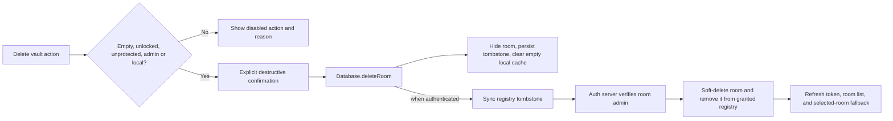

# Plan: Safe Ewe Note Vault-Room Deletion

## Goal

Make the top-level vault rows shown in Ewe Note expose a clear, safe deletion action, so an eligible empty vault such as an empty secure vault can be removed without permitting recursive note loss or unauthorized room deletion.

## Scope

- In: empty top-level Ewe Note note-room deletion, visible vault deletion UI, destructive confirmation, local-first persistence, admin enforcement for synced rooms, protected/default-room handling, focused automated tests, synthetic browser QA, and release verification.
- In: keep the existing ordinary nested-folder delete behavior unchanged.
- Out: recursive deletion of notes or subfolders, deletion of non-empty vaults, deletion of mounted filesystem files, hard deletion of sync-relay persistence, cleanup of real production rooms, and automatic duplicate-name cleanup.

## Assumptions / Open Questions

- Assumption: the rows in the supplied screenshot are top-level note rooms represented as vaults, not ordinary nested folders.
- Assumption: user-facing copy uses `vault` for top-level room-backed workspaces and `folder` only for the hierarchy inside a vault.
- Assumption: an encrypted vault must be unlocked before emptiness can be trusted and deletion enabled.
- Assumption: a synced room may be deleted only by a room admin; a locally created, not-yet-synced room may be deleted locally.
- Assumption: an eligible delete is effective in Ewe Note and room access state, while any mounted filesystem vault remains untouched.
- Approved behavior: empty-vault-only deletion; non-empty vaults show a disabled `Delete vault` item with the reason rather than offering recursive deletion.

## Domain Language

- Glossary docs: `GLOSSARY.md`, `packages/db/GLOSSARY.md`, `packages/auth-server-hono/GLOSSARY.md`, and `packages/ewe-note/GLOSSARY.md`.
- New terms: none.
- Changed terms: none. The existing canonical terms `vault`, `note room`, `room ACL`, and `local persistence` cover this work.
- ADR candidates: none. This applies the existing room soft-delete and local-first model rather than introducing a new persistence decision.

## Deletion Flow

## Runs

## Run Order And Manual Test Handoffs

Run order: sequential. The auth guard must land before the client starts sending room-deletion tombstones; UI work depends on the SDK deletion contract. After every run, Coder updates the Execution Summary and records the focused manual handoff.

### Run 1: Enforce Authorized Room Tombstones

- **Id**: `run-1`
- **Title**: `Enforce Authorized Room Tombstones`
- **UI classification**: `ui: false`
- **Browser checkpoint**: `none`
- **Deliverable**:
  - Registry sync honors a client room tombstone only when the access-grant owner is an admin of that room.
  - Read/write collaborators cannot delete a shared room by submitting `_deleted: true`.
- **Files**:
  - `packages/auth-server-hono/src/services/rooms/sync-rooms-with-client.ts`: add admin authorization to the existing client tombstone handling.
  - `packages/auth-server-hono/src/services/rooms/sync-rooms-with-client.test.ts`: cover admin deletion and collaborator rejection.
- **Steps**:
  - [x] Derive deletable room IDs from the authoritative server-room ACL, not client-provided ACL fields.
  - [x] Ignore or reject unauthorized tombstones without removing the room from the authoritative registry.
  - [x] Preserve the existing access-grant and refreshed-token behavior for successfully deleted rooms.
- **Tests**:
  - `npm test --workspace @eweser/auth-server-hono -- sync-rooms-with-client`
- **Verification**:
  - Confirm an admin tombstone soft-deletes the room and a non-admin tombstone leaves it available.
- **Manual test handoff**:
  - Not needed: this run is covered at the service boundary and becomes user-visible only through Run 3.
- **Dependencies**:
  - None.
- **Model tier**: `strong`
- **Risk level**: `high`

### Run 2: Add Local-First Safe Room Deletion To The SDK

- **Id**: `run-2`
- **Title**: `Add Local-First Safe Room Deletion To The SDK`
- **UI classification**: `ui: false`
- **Browser checkpoint**: `none`
- **Deliverable**:
  - A public `Database.deleteRoom` operation refuses protected, locked, or non-empty rooms; removes an eligible empty room from the loaded collection; persists a tombstone while offline; and completes server registry sync when available.
  - Deleted tombstones do not reload or reappear after refresh while awaiting sync.
- **Files**:
  - `packages/db/src/methods/deleteRoom.ts`: implement safe room eligibility checks and deletion lifecycle.
  - `packages/db/src/methods/deleteRoom.test.ts`: cover empty, non-empty, protected, locked, offline, online, and rejected deletion cases.
  - `packages/db/src/index.ts`: expose the method and skip loading deleted registry tombstones.
  - `packages/db/src/methods/connection/syncRegistry.ts`: preserve or restore correct local state based on the authoritative sync result.
  - `packages/db/src/methods/connection/syncRegistry.test.ts`: verify tombstone persistence and authoritative reconciliation.
  - `.changeset/<generated-name>.md`: record the new public SDK behavior.
- **Steps**:
  - [x] Validate emptiness using undeleted documents from the actual room Y.Doc.
  - [x] Refuse deletion for `Database._initialRoomIds`, locked encrypted rooms, and known non-admin remote rooms.
  - [x] Disconnect and remove the eligible room from loaded collections without deleting any non-empty data.
  - [x] Persist `_deleted: true` in the local registry until an authenticated registry sync confirms server removal.
  - [x] Ensure startup skips tombstoned rooms while retaining enough registry state to sync later.
  - [x] Reconcile server rejection by restoring the authoritative room and returning an actionable error.
- **Tests**:
  - `npm test --workspace @eweser/db -- deleteRoom syncRegistry`
  - `npm run type-check --workspace @eweser/db`
- **Verification**:
  - Recreate a database from the same fake local storage and verify the deleted empty room remains absent before and after registry sync.
- **Manual test handoff**:
  - Not needed: the SDK behavior is exercised through synthetic browser flows in Run 3.
- **Dependencies**:
  - `run-1`.
- **Model tier**: `strong`
- **Risk level**: `high`

### Run 3: Expose Delete Vault In Ewe Note

- **Id**: `run-3`
- **Title**: `Expose Delete Vault In Ewe Note`
- **UI classification**: `ui: true`
- **Browser checkpoint**: `full`
- **Deliverable**:
  - Every top-level vault action menu visibly includes `Delete vault`.
  - Eligible empty vaults also show the compact direct trash action used by ordinary folders.
  - Non-empty, protected, locked, and non-admin vaults keep the menu item visible but disabled with a specific reason.
  - Successful deletion selects a safe fallback room, leaves the editor route if needed, and stays deleted after refresh.
- **Files**:
  - `packages/ewe-note/src/db.tsx`: expose room-deletion eligibility and invoke the SDK while keeping `allRooms`, selected room, and selected note coherent.
  - `packages/ewe-note/src/app/contexts/NotesContext.tsx`: expose the room identity/count data needed by the vault action without treating a room as an ordinary folder.
  - `packages/ewe-note/src/app/components/EnhancedSidebar.tsx`: add the direct eligible action, always-visible menu item, reasoned disabled states, and destructive alert dialog.
  - `packages/ewe-note/src/app/components/EnhancedSidebar.test.tsx`: cover eligible, non-empty, protected, locked, and non-admin vault UI states.
  - `e2e/cypress/tests/ewe-note.cy.ts` or `e2e/cypress/tests/ewe-note-secure-room.cy.ts`: delete an empty synthetic vault, verify confirmation, refresh persistence, and verify a non-empty vault cannot be deleted.
- **Steps**:
  - [x] Centralize vault deletion eligibility so direct action, menu state, and the SDK call cannot disagree.
  - [x] Use `Delete vault` for top-level room-backed rows and retain `Delete folder` for ordinary hierarchy folders.
  - [x] Confirm with copy that synced Ewe Note access is removed, mounted filesystem files are untouched, and the operation cannot be undone through the UI.
  - [x] Keep the destructive control visually consistent with the existing compact toolbar and folder-row actions.
  - [x] Surface SDK/server failures in the dialog without optimistically removing an authoritative room.
- **Tests**:
  - `npm test --workspace @eweser/ewe-note -- EnhancedSidebar`
  - focused Cypress spec against a production build.
- **Verification**:
  - Desktop and 390px mobile screenshots for enabled empty vault, disabled non-empty vault, confirmation, and post-refresh absence.
  - Inspect spacing, alignment, balance, truncation, overflow, density, and responsive fit.
- **Manual test handoff**:
  - Run the production build with synthetic signed-out data, create an empty secure vault and a non-empty vault, verify the former deletes after confirmation and refresh while the latter explains why deletion is disabled. Do not test against real production rooms.
- **Dependencies**:
  - `run-2`.
- **Model tier**: `strong`
- **Risk level**: `high`

### Run 4: Cross-Package QA And Publication

- **Id**: `run-4`
- **Title**: `Cross-Package QA And Publication`
- **UI classification**: `ui: true`
- **Browser checkpoint**: `full`
- **Deliverable**:
  - Reviewable PR with a room-deletion data-flow diagram, screenshots, a sanitized gallery, an isolated interactive HTTPS preview, green checks, and verified live production behavior after merge.
- **Files**:
  - `docs/ai/plans/2026-08-04-safe-vault-room-deletion.md`: execution summary and manual handoffs.
  - PR description/evidence only; no unrelated product changes.
- **Steps**:
  - [x] Run package tests first, then root `npm run check` and relevant builds.
  - [x] Run secret scan and inspect all staged docs/evidence for personal or machine-specific content.
  - [x] Review the final diff for recursive deletion, filesystem deletion, ACL bypass, default-room deletion, and stale-room resurrection risks.
  - [x] Capture final synthetic screenshots and publish separate bounded HTTPS app-preview and evidence-gallery links.
  - [ ] Open a focused PR, address review findings, merge only after required checks pass, and verify the active production bundle and live synthetic flow.
- **Tests**:
  - `npm test --workspace @eweser/auth-server-hono`
  - `npm test --workspace @eweser/db`
  - `npm test --workspace @eweser/ewe-note`
  - `npm run build --workspace @eweser/ewe-note`
  - `npm run check`
- **Verification**:
  - Trace merge commit to successful release and confirm `note.eweser.com` exposes `Delete vault` for a synthetic eligible room while refusing deletion of a synthetic non-empty room.
- **Manual test handoff**:
  - Provide the production route, fixture/auth mode, screenshot gallery, interactive preview lifetime, cleanup command, and any remaining verification gap.
- **Dependencies**:
  - `run-3`.
- **Model tier**: `strong`
- **Risk level**: `high`

## Stop Conditions

Stop and ask for user approval if:

- Implementation would delete notes, nested folders, attachment bytes, mounted filesystem files, or a real production room.
- The current access-grant identity cannot prove room-admin authority from authoritative server data.
- Supporting offline deletion requires silently discarding a non-empty or unreadable Y.Doc.
- A default/initial room would be left without a safe replacement or recreated after deletion.
- A PostgreSQL migration, new hard-delete endpoint, sync-relay persistence deletion, or broader account/grant redesign becomes necessary.
- Verification exposes a blocking issue outside this plan's empty-vault deletion boundary.

## Approval Boundary

Approval of this plan authorizes Coder to implement the four runs above, add the required public SDK changeset, write and run focused tests, perform synthetic destructive browser QA, open a focused PR, address in-scope review findings, merge after green checks, and verify the published production UI.

Approval does not authorize deleting or modifying any real production room, note, mounted filesystem vault, credential, migration, or unrelated data; recursive deletion; direct pushes to `main`; or broader auth/grant behavior outside admin enforcement for room tombstones.

## Execution Summary

| Run     | Status      | Files Changed                                                            | Verification                                                                                        | Notes                                                                                                                                                                                             |
| ------- | ----------- | ------------------------------------------------------------------------ | --------------------------------------------------------------------------------------------------- | ------------------------------------------------------------------------------------------------------------------------------------------------------------------------------------------------- |
| `run-1` | Complete    | Auth room-registry sync service and focused tests                        | 5 focused tests and package type-check passed                                                       | Server-authoritative admin ACLs now gate tombstones; client-forged admin fields are ignored.                                                                                                      |
| `run-2` | Complete    | DB deletion method/tests, registry reconciliation, public API, changeset | 16 focused tests, package type-check, and package build passed                                      | Uses real Y.Doc contents, keeps offline tombstones, and restores rooms rejected by the server.                                                                                                    |
| `run-3` | Complete    | Ewe Note DB context, sidebar UI/tests, and secure-room Cypress spec      | 13 component tests, package type-check/build, and full synthetic desktop/mobile browser flow passed | Browser QA also found and fixed the secure-vault badge initially showing `Standard`; the focused Cypress CLI run is blocked locally by missing Xvfb and remains covered by the committed CI spec. |
| `run-4` | In progress | Plan/evidence and publication metadata                                   | Root check, secret scan, code-index check, and diff check passed                                    | Final sanitized screenshots are captured; PR, CI, deployment, and live verification remain.                                                                                                       |

## Manual Test Result

- **Plan / runs**: `2026-08-04-safe-vault-room-deletion`; Runs 3 and 4.
- **Result**: Pass with one environment note.
- **Coverage**: In a production build with signed-out synthetic local data, created an empty secure vault, confirmed the E2EE state, verified both the direct trash action and `Delete vault` menu item, canceled once, created a note, verified deletion became disabled with `Move or delete its 1 note first.`, removed the note, confirmed deletion, refreshed, and verified the vault stayed absent.
- **Responsive coverage**: Repeated the blocked state and confirmation at a narrow mobile viewport.
- **Visual assessment**: The direct action aligns with existing row controls; the menu remains compact and unclipped; the disabled reason wraps legibly; the destructive confirmation has clear hierarchy and safe button placement; desktop and mobile layouts have no overflow or cramped controls.
- **Environment note**: The local Cypress binary could not start because this machine lacks Xvfb (`spawn Xvfb ENOENT`). The equivalent flow passed manually in the visible browser, and the Cypress regression spec is committed for CI.

## Self-Reflection / Instruction Improvements

- The original delete-action work should have distinguished ordinary folders from top-level vault rooms during scope validation and included both fixture kinds in the initial browser checkpoint.
- Future action-menu changes should test every row kind with both enabled and blocked fixtures, plus an immediate post-create state check; that is what caught the stale `Standard` badge before publication.
