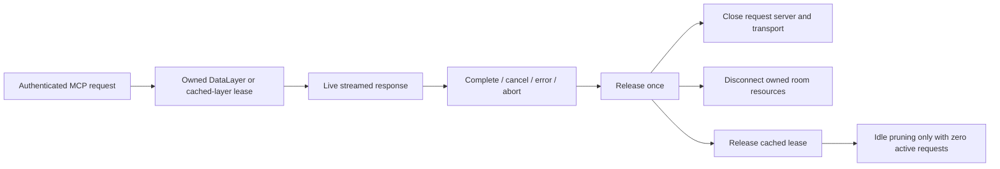

# MCP stateless resource lifecycle

## Goal

Release request-owned room connections and MCP resources after the streamed HTTP response completes, cancels, or errors. Prevent resources from surviving rejected setup or cancelled initialization.

## Scope

Approved by the October 5 source-implementation request. Implement request lifecycle cleanup, DataLayer resource teardown, and protection for cached layers used by overlapping requests. Preserve OAuth, agent-token, permission, scope, and room-selection behavior. No dependencies, lazy connections, global cache redesign, database changes, production load tests, restart, or deployment.

## Assumptions / Open Questions

- The deployed source commit was checked read-only and matches the branch base.
- Heap OOM caused the outage. Retention is reproduced by local resource counts; exclusive attribution of the deployed heap still needs a profile.
- Existing cached session behavior remains; this patch only adds lifetime leases and disposes duplicate concurrent setup layers.
- Domain language: root, auth-server, and MCP glossaries apply. No new product terms or ADR needed.

## Runs

### Run 1: Response and session ownership

- Id: 1
- Deliverable: Request-local server/transport cleanup and DataLayer cleanup after body completion, cancellation, error, setup failure, or request abort.
- Files: auth-server MCP route, lifecycle helper, focused route tests, source index.
- Steps: Reproduce missing cleanup with real SDK transports. Wrap streamed response without draining ahead of the client. Keep cleanup idempotent. Lease cached layers and avoid concurrent setup overwrite leaks.
- Tests: Repeated initialize/tools-list, delayed tool stream, cancel/abort, upstream error, rejected setup/start/handling, bodyless response, independent overlap, shared cached-layer overlap/pruning, duplicate setup.
- Verification: Focused tests and auth-server type check.
- Dependencies: None. Model tier: parent. Risk: medium. UI: false. Browser depth: none.

### Run 2: Room resource teardown

- Id: 2
- Deliverable: Provider, document, sync-wait and refresh-timer cleanup; pending token fetch and refresh cannot reopen closed resources.
- Files: MCP DataLayer, focused lifecycle tests, source index, patch changeset.
- Steps: Mark disconnected ownership before callbacks. Cancel pending sync, detach listeners, destroy providers/documents. Dispose each room once and continue releasing other rooms if teardown errors.
- Tests: Real Y.Doc instances with mocked network provider, twenty repeated layer lifetimes, partial init cancellation, timeout with partial success, constructor failure, in-flight refresh, teardown rejection.
- Verification: Focused and package tests, MCP type check/build, root quality gate.
- Dependencies: Run 1. Model tier: parent. Risk: medium. UI: false. Browser depth: none.

## Run Order And Manual Test Handoffs

Runs 1 then 2. For an independent manual check, use runtime-orientation discovery to start only local auth/sync services as described in LOCAL_DEVELOPMENT.md, with a local test token. Read a streamed tool result, cancel another response, and check resources do not accumulate across repeated local requests. No production load test. No UI screenshots are needed because this changes backend resource ownership only.

## Stop Conditions

Stop for new authorization before any production action, auth/scope change, broad redesign, or new dependency. Independent cheap PR shepherd must stop before merge until the parent reviews the exact source commit.

## Approval Boundary

Local source work and validation, PR creation, and validated merge through an independent cheap shepherd are authorized. Deployment remains separate and requires exact authorization. Priority-board reconciliation belongs to the parent.

## Execution Summary

Both runs implemented and internally reviewed. Initial focused route suite reproduced nine failures against the deployed route. The final suite adds thirteen request-lifecycle cases using real SDK server/transports with a mocked DataLayer, and six real-Y.Doc room lifecycle cases with mocked networking. Twenty repeated layer lifetimes return timer counts to zero and destroy each provider/document once.

Validation passed:

- `npm test --workspace @eweser/auth-server-hono`: 227 tests.
- `npm test --workspace @eweser/mcp`: 70 tests.
- Both changed workspace type checks.
- `npm run check`: root lint, format, all workspace types and 889 passing unit tests (one existing todo).
- MCP dependency build and auth-server build.
- `npm run code-index:check` and `git diff --check`.

The first root lint pass found non-null assertions and an unused test parameter; these were corrected before the passing gate. Logger scheduling was isolated from the focused timer count. No auth/scopes/tokens, dependency or lockfile changes. Patch changeset added for the published MCP package. The original read-only evidence and session checkpoint remain outside this PR.

Cypress/local service integration was not run: runtime discovery found no local auth/sync endpoints, and these lifecycle paths are exercised directly by real SDK streamed responses with controlled network resources. PR CI provides its standard E2E smoke gate. No production load test, restart, or deploy was performed by this source task. Exact parent source review and independent cheap PR checks remain before merge. Main-linked deployment/release automation must be considered separately before merge authorization.

## Self-Reflection / Instruction Improvements

Count request resources directly in deterministic local tests. Keep logging transport timers out of the count. A passing frontend health page must not substitute for an API health response.
