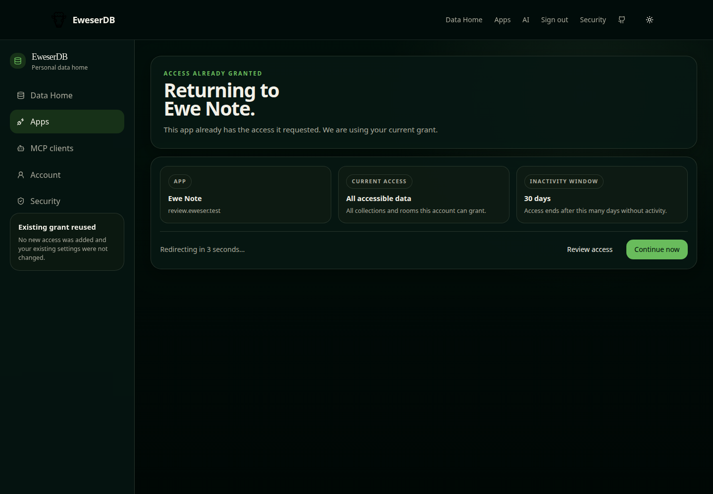
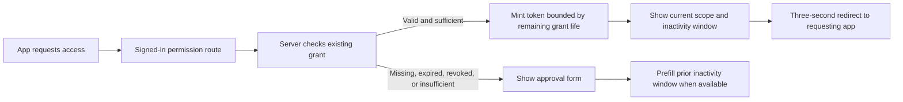

# Existing App Grant Reuse Review

Date: 2026-08-13

## Result

Pass. A valid existing app grant now shows its current scope and inactivity
window, then returns to the requesting app after a three-second countdown. The
user can stop the countdown and review the grant. A grant that is expired,
revoked, or too narrow still requires approval and reuses the prior inactivity
window as the form default.

## Screenshot

The screenshot uses synthetic fixture data. Visual inspection found clear
hierarchy, balanced spacing, aligned summary cards, legible actions, and no
clipping, overflow, or awkward wrapping at 1440 by 1000 pixels.

## Grant Reuse Flow

## Verification

- `npm run check`
- `npm run build --workspace @eweser/auth-server-hono`
- `npm run build --workspace @eweser/app`
- `npm run code-index:check`
- Focused browser checkpoint against a credential-protected, synthetic-only
  preview

No database migration or published-package API change is involved.
