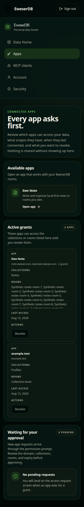

# Connected Apps Mobile Review

Date: 2026-08-13

## Result

Pass. Connected-app grants stack cleanly on mobile, long room lists stay within
an independently scrollable region, known Ewe Note hostname aliases appear as
one app, and one app-level revoke action removes every underlying alias grant.
The Available apps section links directly to Ewe Note.

## Screenshot

The screenshot uses synthetic fixture data at a 390 by 844 pixel viewport.
Visual inspection found clear hierarchy, balanced panel spacing, readable
wrapping, no horizontal overflow, and a contained long-room list. The room list
measured 128 pixels high with 257 pixels of scrollable content.

## Verification

- `npm test --workspace @eweser/app -- App.test.tsx`
- `npm run type-check --workspace @eweser/app`
- `npm run lint --workspace @eweser/app -- --max-warnings=0`
- `npm run build --workspace @eweser/app`
- `npx prettier --check packages/app/src/pages.tsx packages/app/src/index.css packages/app/src/App.test.tsx`
- `git diff --check`
- Focused browser checkpoint against a synthetic-only production bundle

No database migration, backend data-flow change, or published-package API
change is involved.
