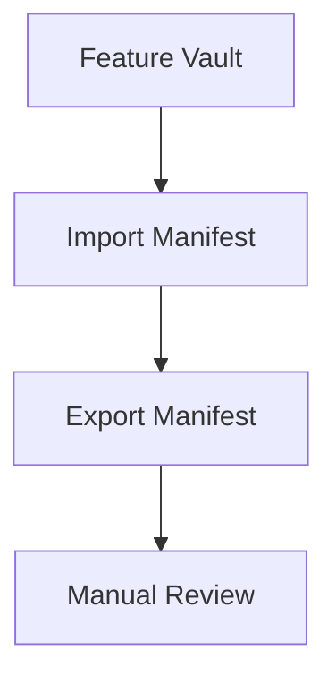

# Code Math and Mermaid

## Inline code

Command: `npm run test --workspace @eweser/ewe-note`

Template literal: `` const label = `vault:${id}` ``

## Fenced code

```typescript
interface VaultFixture {
  file: string;
  category: string;
  requiredHandling: 'render-edit' | 'preserve-round-trip';
}
```

```json
{
  "kind": "source-mode-edge-case",
  "preserve": true
}
```

```yaml
owner: ewe-note
scope:
  - import
  - export
```

## Math

Inline math: $E = mc^2$

Block math:

$$
\sum_{n=1}^{5} n = 15
$$

## Mermaid



## Source-preserve note

If a rich renderer does not own the syntax, source mode should still preserve
the original blocks exactly.
