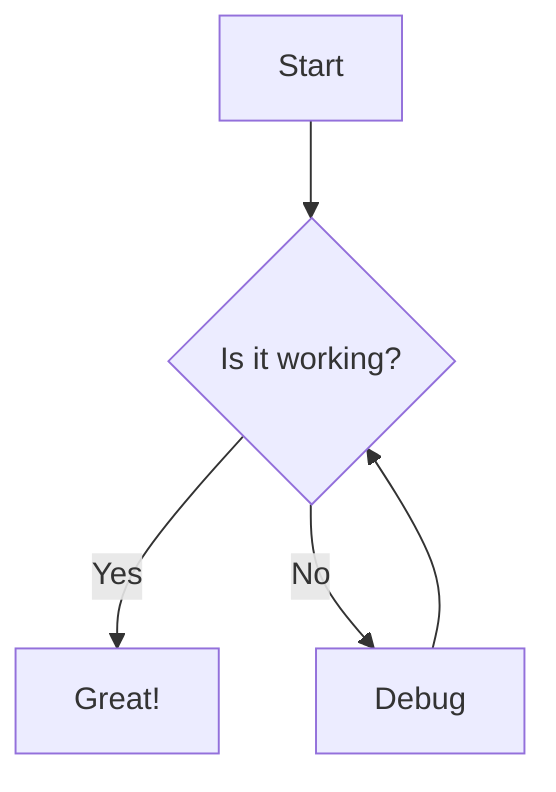
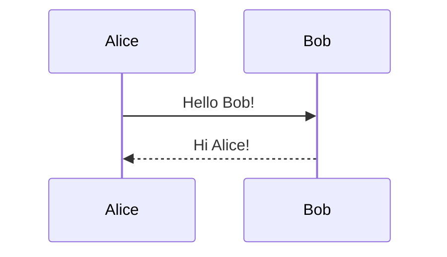

# Math and Diagrams Test Note

<!-- Tests: inline $math$, block $$math$$, mermaid code block -->

## Inline Math

Einstein's famous formula: $E = mc^2$

The quadratic formula: $x = \frac{-b \pm \sqrt{b^2 - 4ac}}{2a}$

Euler's identity: $e^{i\pi} + 1 = 0$

A sum: $\sum_{i=1}^{n} i = \frac{n(n+1)}{2}$

## Block Math

The Pythagorean theorem:

$$a^2 + b^2 = c^2$$

Maxwell's equations:

$$
\nabla \cdot \mathbf{E} = \frac{\rho}{\varepsilon_0}
$$

$$
\nabla \times \mathbf{B} = \mu_0 \mathbf{J} + \mu_0 \varepsilon_0 \frac{\partial \mathbf{E}}{\partial t}
$$

A matrix:

$$
\begin{pmatrix}
a & b \\
c & d
\end{pmatrix}
\begin{pmatrix}
x \\
y
\end{pmatrix}
=
\begin{pmatrix}
ax + by \\
cx + dy
\end{pmatrix}
$$

## Mermaid Diagrams

Flowchart:

Sequence diagram:

## Math Inside Other Blocks

> [!note] Math in Callout
> The area of a circle is $A = \pi r^2$.

Math in a list:

- Derivative: $\frac{d}{dx}[x^n] = nx^{n-1}$
- Integral: $\int x^n \, dx = \frac{x^{n+1}}{n+1} + C$
